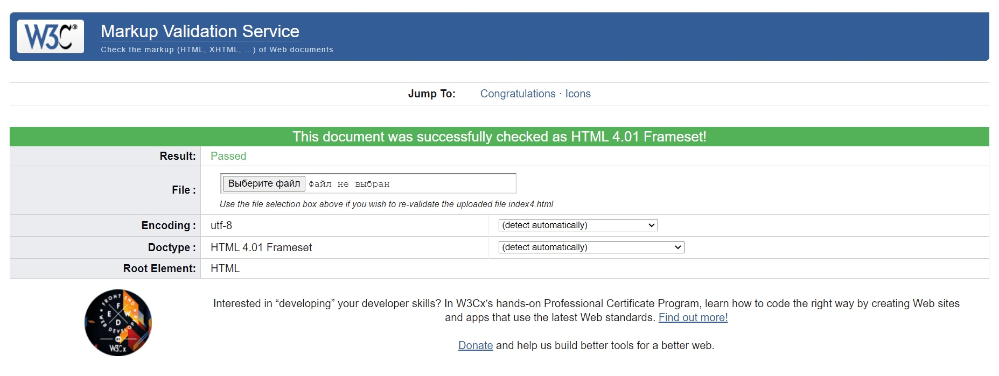

 Министерство науки и высшего образования РФ 
Федеральное государственное бюджетное  
образовательное учреждение высшего образования 
Вятский государственный университет 
Факультет автоматики и вычислительной техники 
Кафедра систем автоматизации управления

 
 
 
 
 
 

<b>Отчет по лабораторной работе №1</b>  
  по дисциплине 
  Основы frontend-разработки и организации человеко-машинного интерфейса 

 
 
 
 
 
 
 
 
 

Выполнил ст.гр. ИТб-1301-01-00____________Балахнина Е.П.

Проверил ст.преподаватель кафедры САУ__________Земцов М.А.

 
 
 
 
 
 
 
 
 

Киров 2021 

 
 
 
 
 
 
 
 
 

Цель лабораторной работы: стилизация и трансформация элементов через CSS. CSS процессоры.  

Задачи лабораторной работы:  
1. Организовать процесс работы над лабораторной работой
2. Изучить материал по основам стилизации элементов
3. Выполнить верстку макета по заданию преподавателя
4. Составить отчет по выполненным задачам
5. Защитить лабораторную работу
  

Ход выполнения лабораторной работы
  

1. Организовать процесс работы над лабораторной работой  
Для начала, в репозитории “Basic frontend dev labs” была создана ветвь “lab3” от стартового коммита главной ветви.  

2. Изучить материал по основам стилизации элементов  
Перед выполнением лабораторной работы был изучен материал с основами работы c оформлением веб-документа  

3. Выполнить верстку макета по заданию преподавателя  
Задание: Сделать верстку веб-страницы(Рисунок 1)  
 

Рисунок 1- Макет веб-страницы  
 
 
Выполненное задание представлено на рисунке 2  

  
Рисунок 2 - Готовый макет                                                                                 
                                                                                  

