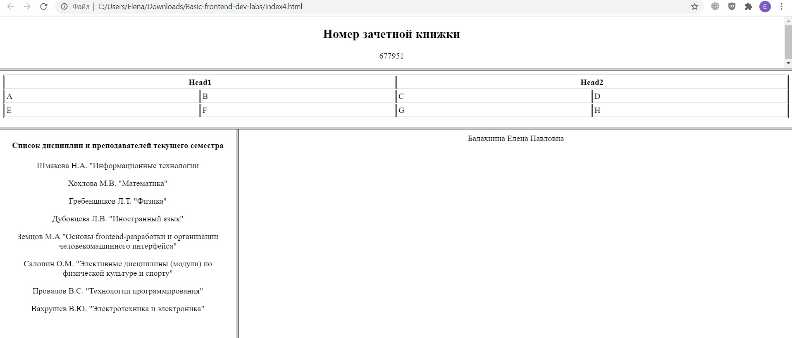

 Министерство науки и высшего образования РФ 
Федеральное государственное бюджетное  
образовательное учреждение высшего образования 
Вятский государственный университет 
Факультет автоматики и вычислительной техники 
Кафедра систем автоматизации управления

 
 
 
 
 
 

<b>Отчет по лабораторной работе №1</b>  
  по дисциплине 
  Основы frontend-разработки и организации человеко-машинного интерфейса 

 
 
 
 
 
 
 
 
 

Выполнил ст.гр. ИТб-1301-01-00____________Балахнина Е.П.

Проверил ст.преподаватель кафедры САУ__________Земцов М.А.

 
 
 
 
 
 
 
 
 

Киров 2021 

 
 
 
 
 
 
 
 
 

Цель лабораторной работы: изучение методов формирования html5 документов на стороне клиента.

Задачи лабораторной работы:  
  1. Организовать рабочее пространство и процессы разработки html5 документов.
  2. Изучить структуру html5 документа
  3. Исследовать функциональные возможности инструментов разработчика на стороне браузера
  4. Изучить типовые элементы структуры html5 документа
  5. Составить отчет по выполненным задачам
  6. Защитить лабораторную работу

#### Задание 1. ####
Создайте HTML-страницу index4.html, разделенную на фреймы в соответствии с номером варианта. В качестве заголовка страницы используйте ваше имя, отчество и фамилию. 
1. номер зачетной книжки;
2. таблицу
3. ваше имя, отчество и фамилию;
4. список дисциплин и преподавателей текущего семестра.  
Ширина фреймов выбирается студентом самостоятельно и должна быть оптимальная для отображения контента (не должно быть скроллинга). Сопутствующие html страницы должны содержать префикс “i4-”.

  

Рисунок 1 - html4 

После реализации html4 была проведена валидация, которая прошла успешно.

### Задание 2. ###
Создайте файл index.html, используя html5 разметку. Файл должен реализовывать предыдущее задание с использованием языка html5. Готовым решением будет успешное прохождение проверки валидации 

Ссылка на HTML-страницу, разделенную на фреймы  
[lab1/index5.html][PlDb]  

[PlDb]: <https://github.com/ElenaBalahnina123/Basic-frontend-dev-labs/blob/lab1/index5.html>
Валидация прошла успешно.

### Ответы на вопросы ###

1. Какие из тегов являются тегами форматирования абзацев?  
+ Элемент p разбивает текст на отдельные абзацы, отделяя друг от друга пустой строкой. Браузер автоматически добавляет верхнее и нижнее внешнее поле margin, равное 1em, при этом поля соседних абзацев «схлопываются».
+ Элемент b переносит текст на следующую строку, создавая разрыв строки.
+ Элемент hr используется для разделения контента на веб-странице. Отображается в виде горизонтальной линии.

2. В чем различие тегов h?
+ Элемент h1  
Заголовок самого верхнего уровня, на странице рекомендуется использовать только один раз, по возможности частично дублируя заглавие страницы. Элемент h1 должен быть уникальным для каждой страницы сайта.
+ Элемент h2  
Представляет подзаголовки элемента h1. Размер шрифта в браузере равен 1.5em, верхний и нижний отступ по умолчанию 0.83em.
+ Элемент h3  
Показывает подзаголовки элемента h2. Размер шрифта в браузере равен 1.17em, верхний и нижний отступ по умолчанию 1em.
+ Элементы h4, h5, h6  
Обозначают подзаголовки четвёртого, пятого и шестого уровня. Размер шрифта в браузере равен 1em / 0.83em / 0.67em, верхний и нижний отступ по умолчанию 1.33em / 1.67em / 2.33em соответственно.

3. Для чего применяется тег code как его использовать?  
Элемент code cлужит для выделения фрагментов программного кода. Отображает текст моноширинным шрифтом.  
<code> Выглядит это так </code>

4. В чем различие тегов code, kbd, samp, var, pre?
+ Элемент code  
Служит для выделения фрагментов программного кода. Отображает текст моноширинным шрифтом.
+ Элемент kbd  
Отмечает фрагмент как вводимый пользователем с клавиатуры. Отображает текст моноширинным шрифтом.
+  Элемент samp  
Применяется для выделения результата, полученного в ходе выполнения программы. Отображает текст моноширинным шрифтом.
+ Элемент var  
Выделяет имена переменных, отображая текст курсивом.
+ Элемент pre  
Позволяет вывести текст на экран, сохранив изначальное форматирование. Пробелы и переносы строк при этом не удаляются.

5. В чем отличие тегов оформления цитат и определений от тегов обычного форматирования текста?  
Элементы для форматирования текста могут задать полужирное начертание шрифта, отобразить шрифт курсивом, уменьшить размер шрифта на единицу, перечеркивают текст и выделяют его. А теги оформления цитат используются для изменения направления текста и выделяют цитаты внутри документа.

6. Для чего применяются теги p, br и hr?  
+ Элемент p  
Разбивает текст на отдельные абзацы, отделяя друг от друга пустой строкой. Браузер автоматически добавляет верхнее и нижнее внешнее поле margin, равное 1em, при этом поля соседних абзацев «схлопываются».
+  Элемент br  
Переносит текст на следующую строку, создавая разрыв строки.
+ Элемент hr  
Используется для разделения контента на веб-странице. Отображается в виде горизонтальной линии.

7. Какая разница в тегах span и p?  
Тег span предназначен для определения строчных элементов документа. В отличие от блочных элементов p, с помощью span можно выделить часть информации внутри других тегов и установить для нее свой стиль.

8. В чем разница между тегами b и strong?  
Элемент b задаёт полужирное начертания шрифта. Выделяет текст без акцента на его важность. Элемент strong задаёт полужирное начертание шрифта и относится к тегам логической разметки, указывая браузеру на важность текста.

### Задание 3. ###
Используя методы разметки текста реализуйте текущее расписание занятий на 2 недели. При реализации необходимо чтобы ссылки на онлайн лекции были меньше и выделены жирным курсивом, фамилия преподавателя была курсивом, а название дисциплины было h4. Использованием стилей недопустимо.  

Ссылка на расписание  
[lab1/raspisanie.html][PlDb]  

[PlDb]: <https://github.com/ElenaBalahnina123/Basic-frontend-dev-labs/blob/lab1/raspisanie.html>

#### Выводы ####

Эволюция html5 облегчила код, так как он стал более компактным. Также увеличилась скорость загрузки и качество получаемых страниц.  
Для структурирования добавлены абсолютно новые теги: 
1. Header, тег заголовка, содержит логотип, наименование, меню
2. Sidebar, тег боковых колонок
3. Article, тег основного контента страницы
4. Section, тег для разбивки текста на части
5. Footer, тег нижней части страницы.

