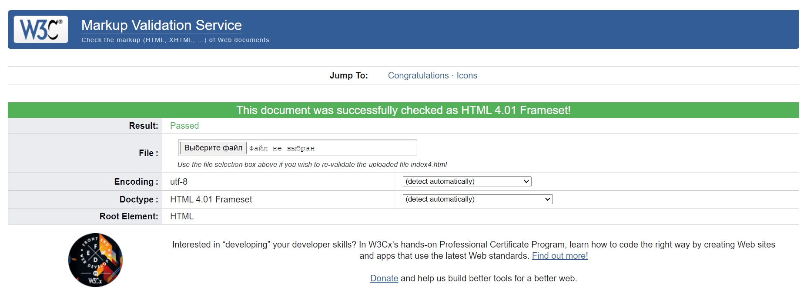
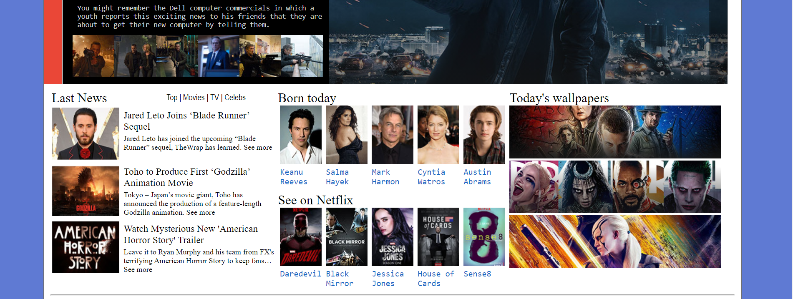
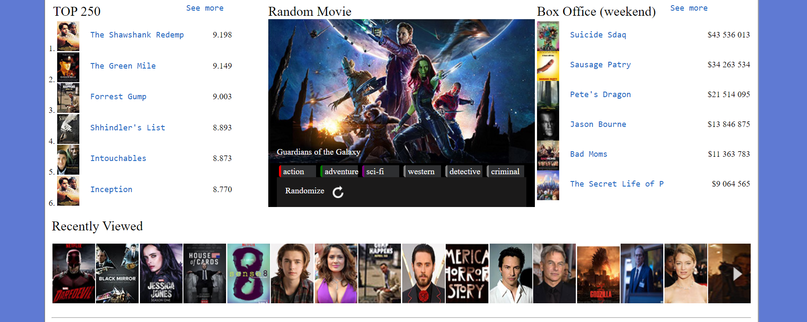
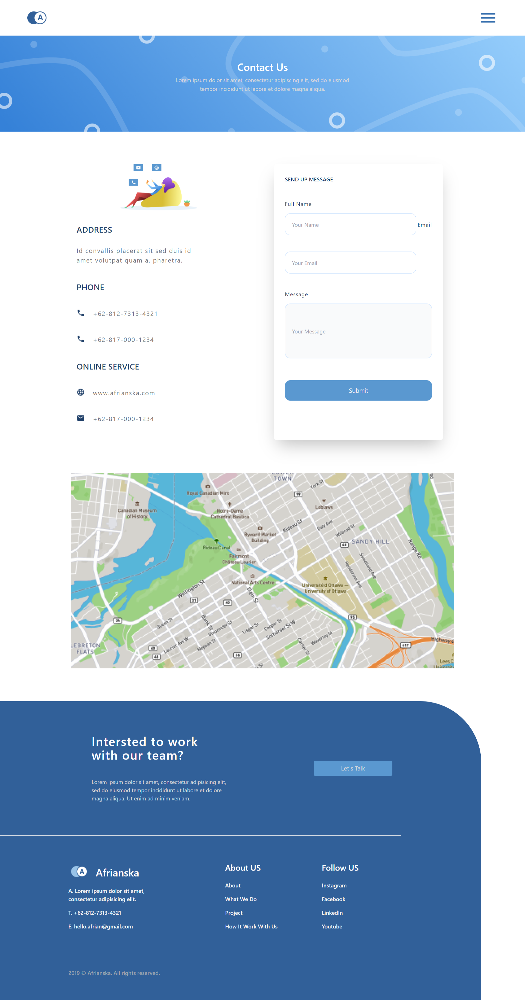
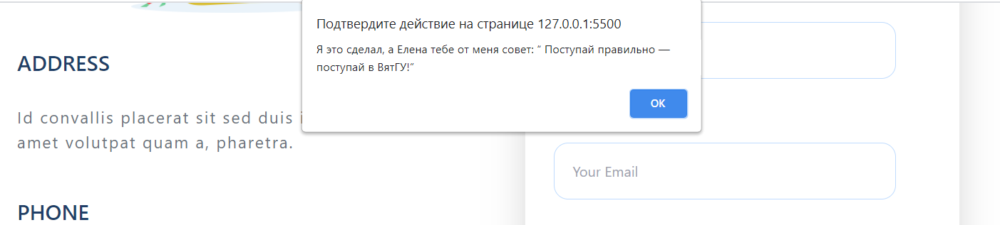

 Министерство науки и высшего образования РФ 
Федеральное государственное бюджетное  
образовательное учреждение высшего образования 
Вятский государственный университет 
Факультет автоматики и вычислительной техники 
Кафедра систем автоматизации управления

 
 
 
 
 
 

<b>Отчет по лабораторной работе №4</b>  
  по дисциплине 
  Основы frontend-разработки и организации человеко-машинного интерфейса 

 
 
 
 
 
 
 
 
 

Выполнил ст.гр. ИТб-1301-01-00____________Балахнина Е.П.

Проверил ст.преподаватель кафедры САУ__________Земцов М.А.

 
 
 
 
 
 
 
 
 

Киров 2021 

 
 
 
 
 
 
 
 
 

Цель лабораторной работы: изучение основ языка JavaScript.  

Задачи лабораторной работы:  
1. Изучить основные элементы и подходы к программированию в JavaScript
2. Изучить подходы к работе JavaScript в браузере
3. Выполнить верстку макета по заданию преподавателя
4. Составить отчет по выполненным задачам
5. Защитить лабораторную работу 

Ход выполнения лабораторной работы
  

1. Изучить основные элементы и подходы к программированию в JavaScript 
Перед выполнением лабораторной работы была изучена документация по основам языка JavaScript.  

2. Изучить подходы к работе JavaScript в браузере  
При работе с браузером был изучен материал о том, что такое DOM-дерево и как работать с событиями.  

3. Выполнить верстку макета по заданию преподавателя 
Для начала, в репозитории “Basic frontend dev labs” была создана ветвь “lab4” от стартового коммита главной ветви.  

При вычислении был получен 1 вариант работы. Макет сайта для 1 варианта представлен ниже на рисунках 1-3.  

  

Рисунок 1 - Homepage 

 
  

Рисунок 2 - Blogpage 

 
  

Рисунок 3 - Contact Us 

 

Данный макет нужно реализовать с помощью библиотеки Tailwind, поэтому мною был установлен помощник для редактора кода. Для начала работы с данным помощником было применено официальное руководство пользования.  

Готовый макет представлен на рисунках 4-6 ниже.

  

Рисунок 4 - Готовый макет Homepage 

 

  

Рисунок 5 - Готовый макет Blogpage 

 

  

Рисунок 6 - Готовый макет Contact Us 

 
 
К полученной странице необходимо добавить на все кнопки интерактивное сообщение "Я это сделал, а @UserName тебе от меня совет: “ Поступай правильно — поступай в ВятГУ!”. Вывод сообщения должен производится для вариантов 1 и 5 в виде promt, 2-3 в виде модального окна, а 4 и 6 - в форме всплывающего уведомления. Ввод @UserName обязателен при первом выводе окна. Последующие выводы сообщений не должны требовать ввода @UserName.

Выполненное задание представлено на рисунках 7 и 8.

  

Рисунок 7 - Уведомление с вводом имени

 

  

Рисунок 8 - Уведомление после ввода имени 

 

