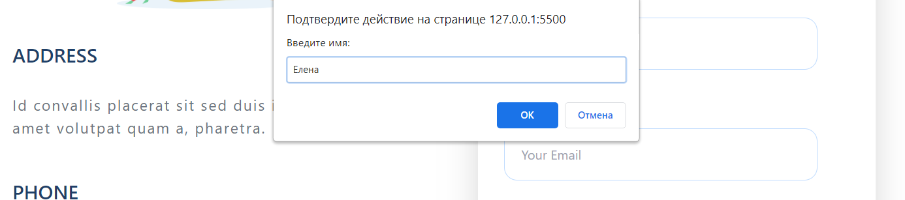

 Министерство науки и высшего образования РФ 
Федеральное государственное бюджетное  
образовательное учреждение высшего образования 
Вятский государственный университет 
Факультет автоматики и вычислительной техники 
Кафедра систем автоматизации управления

 
 
 
 
 
 

<b>Отчет по лабораторной работе №4</b>  
  по дисциплине 
  Основы frontend-разработки и организации человеко-машинного интерфейса 

 
 
 
 
 
 
 
 
 

Выполнил ст.гр. ИТб-1301-01-00____________Балахнина Е.П.

Проверил ст.преподаватель кафедры САУ__________Земцов М.А.

 
 
 
 
 
 
 
 
 

Киров 2021 

 
 
 
 
 
 
 
 
 

Цель лабораторной работы: изучение основ языка JavaScript.  

Задачи лабораторной работы:  
1. Изучить основные элементы и подходы к программированию в JavaScript
2. Изучить подходы к работе JavaScript в браузере
3. Выполнить верстку макета по заданию преподавателя
4. Составить отчет по выполненным задачам
5. Защитить лабораторную работу 

Ход выполнения лабораторной работы
  

1. Изучить основные элементы и подходы к программированию в JavaScript 
Перед выполнением лабораторной работы была изучена документация по основам языка JavaScript.  

2. Изучить подходы к работе JavaScript в браузере  
При работе с браузером был изучен материал о том, что такое DOM-дерево и как работать с событиями.  

3. Выполнить верстку макета по заданию преподавателя 
Для начала, в репозитории “Basic frontend dev labs” была создана ветвь “lab4” от стартового коммита главной ветви.  

При вычислении был получен 1 вариант работы. Макет сайта для 1 варианта представлен ниже на рисунках 1-3.  

  

Рисунок 1 - Homepage 

 
  

Рисунок 2 - Blogpage 

 
  

Рисунок 3 - Contact Us 

 

Данный макет нужно реализовать с помощью библиотеки Tailwind, поэтому мною был установлен помощник для редактора кода. Для начала работы с данным помощником было применено официальное руководство пользования.  

Готовый макет представлен на рисунках 4-6 ниже.

  

Рисунок 4 - Готовый макет Homepage 

 

  

Рисунок 5 - Готовый макет Blogpage 

 

  

Рисунок 6 - Готовый макет Contact Us 

 
 
К полученной странице необходимо добавить на все кнопки интерактивное сообщение "Я это сделал, а @UserName тебе от меня совет: “ Поступай правильно — поступай в ВятГУ!”. Вывод сообщения должен производится для вариантов 1 и 5 в виде promt, 2-3 в виде модального окна, а 4 и 6 - в форме всплывающего уведомления. Ввод @UserName обязателен при первом выводе окна. Последующие выводы сообщений не должны требовать ввода @UserName.

Выполненное задание представлено на рисунках 7 и 8.

  

Рисунок 7 - Уведомление с вводом имени

 

  

Рисунок 8 - Уведомление после ввода имени 

 
 

Пошаговая инструкция создания проекта:  
1. Необоходимо создать html-разметку.
2. Подключить библиотеку Tailwind.
3. В помощью этой библиотеки создать макет.
4. Добавить на JavaScript на все кнопки интерактивное сообщение  

Вывод: в ходе работы были изучены основные элементы и подходы к программированию в JavaScript, приобретены знания и навыки по работе с библиотекой tailwind. 

Приложение А  
 
(обязательное) 
 
Листинг homepage 
 

  <!DOCTYPE html>
  <html lang="en">
  <head>
    <meta charset="UTF-8">
    <meta http-equiv="X-UA-Compatible" content="IE=edge">
    <meta name="viewport" content="width=device-width, initial-scale=1.0" />
    <title>HomePage</title>
    <link rel="stylesheet" href="homePage.css">
    <link href="https://unpkg.com/tailwindcss@^2/dist/tailwind.min.css" rel="stylesheet">
    
  </head>
  <body>
   <header>
      

        <nav class="relative px-20 py-6 flex justify-between items-center ">
          
          
        </nav>
        

          

             <h2 class="mb-6 lg:text-7xl font-medium text-blue-900 px-40">
                New Automation  
                Tool for Your Home
             </h2>
          

          

              
Lorem ipsum dolor sit amet, consectetur adipiscing   elit. Faucibus tristique vulputate ultrices ut   mauris  tellus at. Posuere sollicitudin odio tellus elit.

          
 
        <button id="knopka" class="bg-bluecolor1 rounded-md text-white p-5 mt-24 mb-52 px-20 ml-40" onclick="showAlert();">
           See Our Project 
      </button>
       
 
     

    </header>
   <main>
     

        
What we do to help  our client grow in  digital era.

          

               
               
Bring Technology To Your Comfrotable Home

               
Lorem ipsum dolor sit amet,   consectetur adipiscing elit, sed do   eiusmod tempor incididunt ut  labore et dolore magna aliqua.

               

                <a class="mt-8 px-6 mb-16 text-indigo-500 inline-flex items-center">Learn More
                  <svg fill="none" stroke="currentColor" stroke-linecap="round" stroke-linejoin="round" stroke-width="2" class="w-4 h-4 ml-2" viewBox="0 0 24 24">
                    <path d="M5 12h14M12 5l7 7-7 7"></path>
                  </svg>
                </a>
               

          

           

               
               
Make Your business To Be  Better Famous In Internet

               
Lorem ipsum dolor sit amet,   consectetur adipiscing elit, sed do   eiusmod tempor incididunt ut   labore et dolore magna aliqua.

               

                <a class="mt-8 px-6 mb-16 text-indigo-500 inline-flex items-center">Learn More
                  <svg fill="none" stroke="currentColor" stroke-linecap="round" stroke-linejoin="round" stroke-width="2" class="w-4 h-4 ml-2" viewBox="0 0 24 24">
                    <path d="M5 12h14M12 5l7 7-7 7"></path>
                  </svg>
                </a>
               

            

         

             
              
Build Your Digital Product  That Suitable For Your Need

              
Lorem ipsum dolor sit amet,   consectetur adipiscing elit, sed do   eiusmod tempor incididunt ut     labore et dolore magna aliqua.

             

              <a class="mt-8 px-6 mb-16 text-indigo-500 inline-flex items-center">Learn More
                <svg fill="none" stroke="currentColor" stroke-linecap="round" stroke-linejoin="round" stroke-width="2" class="w-4 h-4 ml-2" viewBox="0 0 24 24">
                  <path d="M5 12h14M12 5l7 7-7 7"></path>
                </svg>
              </a>
              

          

     

     

        

              
Our Finished  Project

              
Lorem ipsum dolor sit amet, consectetur adipisicing elit, sed do   eiusmod tempor incididunt ut labore et dolore    magna aliqua. Ut   enim ad minim veniam.

        

          

            

              

                
                

                  <h2 class="text-2xl text-white font-medium title-font mb-2">Smart Home Installation</h2>
                  
In Muarakana Housing Estate

                

              

              

                

                  

                    
                    

                      <h2 class="text-2xl text-white font-medium title-font mb-2">Sparklite App</h2>
                      
Marketplace

                    

                  

                

                

                  

                    
                    

                      <h2 class="text-2xl text-white font-medium title-font mb-2">Car-Rapetition App</h2>
                      
Board

                    

                  

                

              

            

          

    

   </main>
   <footer>
     

      

        
Our Beloved  Client

        
Lorem ipsum dolor sit amet, consectetur adipisicing elit, sed do   eiusmod tempor incididunt ut labore et dolore  magna aliqua. Ut   enim ad minim veniam.

     

     

      

      
LOGO CLIENT 1

    

    

      
LOGO CLIENT 2

    

    

      
LOGO CLIENT 3

    

    

      
LOGO CLIENT 4

    

    

      
LOGO CLIENT 5

    

    

      
LOGO CLIENT 6

    

    

      
LOGO CLIENT 7

    

    

      
More Client

    

     

     

        

          

            

            
Intersted to work  with our team?

            
Lorem ipsum dolor sit amet, consectetur adipisicing elit,    sed do eiusmod tempor incididunt ut labore et dolore   magna aliqua. Ut enim ad minim veniam.

          

          <form name="forma16">
            <input class="flex-shrink-0 ml-64 text-gray-300 bg-bluecolor1  py-2 px-20  rounded text-lg  sm:mt-0" type="button" value="Let's Talk" onClick="showAlert()">
        </form>
          

        

       

        

          

            

              

                
              

              

                <h2 class="text-white text-3xl title-font font-medium mt-2 mb-3">Afrianska</h2>
                <nav class="flex flex-col -ml-20 mt-6 lg:text-1xl text-gray-100 leading-6  font-medium">
                  <a class="leading-2 mb-4">A.  Lorem ipsum dolor sit amet,  consectetur adipisicing elit.</A.> </a>
                  <a class="leading-2 mb-4">T.  +62-812-7313-4321</a>
                  <a class="leading-2 mb-4">E.  hello.afrian@gmail.com</a>
                  
2019 © Afrianska. All rights reserved.

                </nav>
              

            

            

              

                <h2 class="text-white text-2xl title-font font-medium ml-24 -mt-1 mb-3">About US</h2>
                <nav class="flex flex-col mt-6 ml-24 lg:text-1xl text-gray-100 leading-6  font-medium ">
                  <a class="leading-2 mb-4 ">About</a>
                  <a class="leading-2 mb-4">What We Do</a>
                  <a class="leading-2 mb-4">Project</a>
                  <a class="leading-2 mb-4">How It Work With Us</a>
                </nav>
              

            

            

              

                <h2 class="text-white text-2xl title-font font-medium -mt-1 mb-3 ml-12">Follow US</h2>
                <nav class="flex flex-col mt-6 lg:text-1xl text-gray-100 leading-6  font-medium ml-12">
                  <a class="leading-2 mb-4 ">Instagram</a>
                  <a class="leading-2 mb-4">Facebook</a>
                  <a class="leading-2 mb-4">LinkedIn</a>
                  <a class="leading-2 mb-4">Youtube</a>
                </nav>
              

            

          

        

    

   </footer>
  </body>
  </html>
